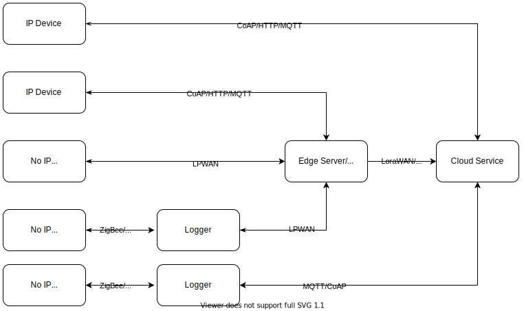

## Title: Smart Agriculture: open-field agriculture

### Submitter(s): 

Cristiano Aguzzi

### Reviewer(s):

### Tracker Issue ID:

### Category:
Smart Agriculture

### Class: 
Open field agriculture

### Status: WIP

### Target Users

Agricultural corporation, Farmer, Manufacturers (Sensor, other facilities), Cloud provider, Middleware provider, Network providers, service provider. 

### Motivation:
Water is vital for ensuring food security to the world’s population, and agriculture is the biggest consumer amounting for 70% of freshwater. Field irrigation application methods are one of the main causes of water wastage. The most common technique, surface irrigation, wastes a high percentage of the water by wetting areas where no plants benefit from it. On the other hand, localized irrigation can use water more efficiently and effectively, avoiding both under-irrigation and over-irrigation. However, in an attempt to avoid under-irrigation, farmers feed more water than is needed resulting not only to productivity losses, but also water wastages. 

Therefore, technology should be developed and deployed for sensing water needs and automatically manage water supply to crops. However, open field agriculture is characterized by a quite dynamic range of requirements. Usually, solutions developed for one particular crop type cannot be reused in other cultivations. Moreover, the same field can have different crop types or different sizes/shapes during the years, meaning that technology to monitor the state of crop growth should be highly configurable and adaptive. Even agriculture and irrigation methods can change and also they are very different depending on the size of the field and its clime type. 

Consequently, silos applications are deployed leveraging on IoT technologies to gather data about the crop growth state and irrigation needs. The Web of Things may help to create a single platform where cost-effective applications could adapt seamlessly between different scenarios, breaking the silos and giving value both to the environment and the market.    

### Expected Devices:

Sensors: 
 - Weather sensors (maybe collected together inside a [weather station](https://en.wikipedia.org/wiki/Weather_station)):
    - temperature 
    - air humidity 
    - air pressure 
    - pluviometer 
    - global solar radiation
    - anemometer (wind speed)
    - wind direction   
    - global solar radiation and photosynthetically active radiation 
    - gas/air quality sensor (i.e. CO2)
- Soil sensors (usually packed together in soil probes)
    - soil temperature
    - soil moisture/water content
    - soil conductivity (detecting salt levels in the soil)
    - water table sensor  
- Drone sensors
    - camera
    - temperature sensitive camera
    - multispectral camera

Actuators:
- drones: used for data collection or pesticed/impollination
- sprinklers
- pumps
- central pivot sprinklers
- hose-reel irrigation machine

Additional devices:
- Solar panels
- Loggers: units that collect data from close sensors. 
- Gateways

### Expected Data:
Sensor data plays a central role in Smart Agriculture. In particular, it is critical that the information sensed is associated with a timestamp. Common algorithms use *time series* to calculate the water needs of a crop. 

Furthermore, soil sensors usually are calibrated over a specific soil type (which may differ even in the same geographic region). For example, the calibration data for a soil moisture sensor is represented by a function that maps sensor output to soil water content. In literature, this function is knowns as a *calibration curve*. Commercial sensors are precalibrated with a "standard" curve but on most occasions, it fails to accurately measure the water content. Therefore, it can be configured during the installation phase (which may happen every time the soil is plowed). 

Finally, a crucial aspect is forecasting. Farmers use this information to actively change their management procedures. Services exploit it to suggest irrigation schedule or change device settings to behave accordingly to environmental changes.  

To summarize here it is a list of most important expected data from Open field agriculture:

- Calibration curve
- Time series
- Forecast data
- Geolocations: sensor data must be contextualized in geolocation. Also, geolocation is critical in massive open fields to localize instrument position.
- Weather data
- Unit of measure: commercial soli sensor may output their value in a different unit of measures (i.e. volts or % water in an m^3 of soil)
- Relative values
- Depth position: geolocation is not sufficient to describe the parameters of the soil. Depth is an additional context that should be added to an observed value.  
- Device owner information
- Battery level and energy consumption

### Dependencies:

WoT Architecture, WoT Thing Description

### Description:
In open-field agriculture, the IoT solutions leverage on different radio protocols and devices. Usually, radio protocols should cover long distances (even kilometers) and be energy efficient. Devices too need to be energy saving as they are deployed for months and sometimes even years in harsh environments. A sleeping-cycle is one mechanism they use to save energy usually coordinated by *loggers/gateways* or preprogrammed. *Loggers* are deployed closed to sensor devices and have more storage space. They serve as buffers between sensors and higher services. Often *loggers* and sensors are embedded in the same board, otherwise, they are connected using cables or close-ranged radio protocols. On the other hand, *gateways* serve as a collection point for data of an entire field or farm. They are much more capable devices and usually are more energy-consuming. In some deployment scenarios, they host a full operating system with multiple software facilities installed.  Otherwise, gateways only serve as relays of data sent from the loggers and sensors to cloud services and vice-versa.  The cloud services may be partially hosted in edge servers to preserve data privacy and responsiveness of the whole IoT solution. Possible cloud services are:
- Weather forecasting/local weather forecasting
- Soil digital twin to simulate and predict water content
- Plant digital twin (growth and water needs prediction)
- Irrigation advice service: combining the previous services and knowing the irrigation system topology is possible to advise farms with the best times to irrigate a crop.  
- Pesticide and fertilize planning

The complete deployment topology of an open field agriculture solution is described in the diagram below:

#### Variants:
Open-field agriculture varies a lot between geographical location and methods. For example in the [SWAMP project](http://swamp-project.org/) there three different pilots with different requirement/constraints:
- [Italian pilot](http://swamp-project.org/cbec/) (Reggio Emilia region):
    - Relative small field size
    - Multiple connectivity solutions available: 4G, LPWAN, and WiFi
    - Variance in crop types, sometimes even inside the same farm
    - Small soil type variance
    - Precise model soil behavior
    - A great influence of the water table
    - Variance in the irrigation system
    - Channel-based water distribution
    - The main goal is to optimize water consumption
- [Brazilian pilot](http://swamp-project.org/matopiba/) (Matopiba and Guaspari location):
    - Huge field size
    - Centra pivot irrigation systems: need to optimize each sprinkler output
    - Soil type variance within the same field
    - A low number of connectivity options: no 4G, only radio communication base on LPWAN
    - Low crop type variance
    - the main goal is to optimize energy consumption
- [Spain pilot](http://swamp-project.org/intercrop/)
    - Efficient localized irrigation and application of the right amount of water to the crop 
    - arid location
    - The goal is to minimize water consumption but maintaining a good field yield. 

### Gaps:
Currently, there is no specification on how to model device status (i.e. connected/disconnected)
Examples of how to handle a device calibration phase may help developers to use a standardized approach. 
Possibly define standard links types to define the relation between loggers and sensors
Handle both geographical position and depth information. 
Ontology class for battery and energy consumption
Model historical and forecast data

### Existing standards:

- [LPWAN](https://tools.ietf.org/html/rfc8376)
- [SDI 12](http://www.sdi-12.org/current_specification/SDI-12_version-1_4-Jan-10-2019.pdf)
- [CoAP](https://tools.ietf.org/html/rfc7252)
- [MQTT](https://docs.oasis-open.org/mqtt/mqtt/v5.0/mqtt-v5.0.html)

### Comments:

This use case is designed using the experience gained in the European-Brazil Horizon 2020 SWAMP project. Please follow the [link](http://swamp-project.org/) for further information. Since SWAMP is heavily oriented to optimize water consumption, this document just mentioned issues like plant feeding, fertilizing, pollination, yield prediction, crop quality measurement,  etc. Nevertheless, WoT technologies may be employed also in these scenarios. 
