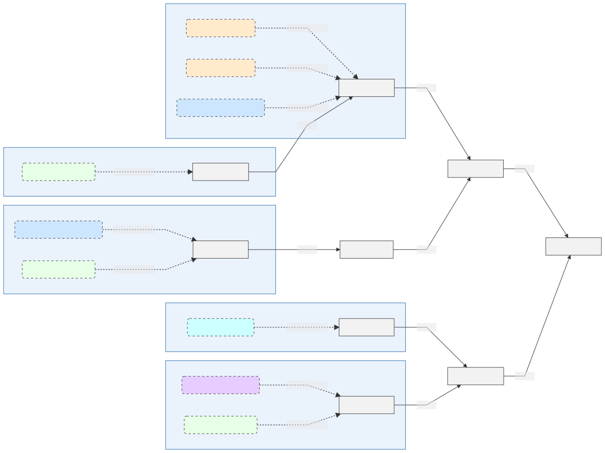
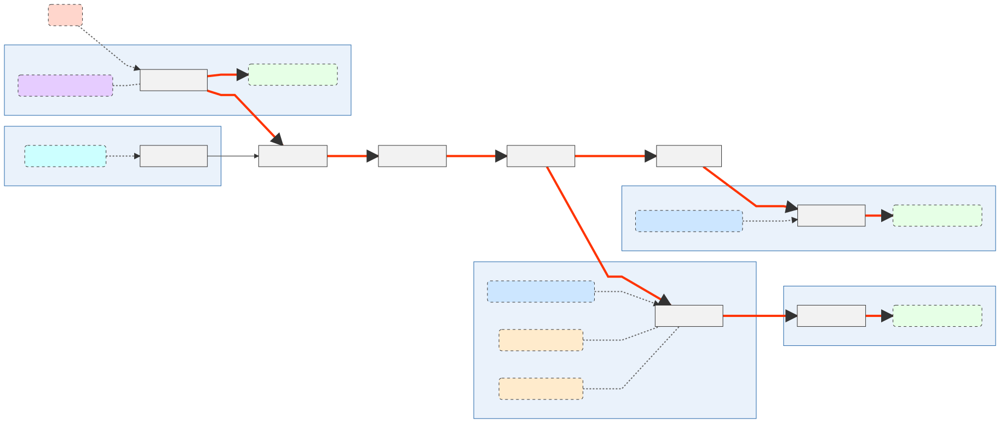

## Title: Cross-Domain Discovery in a Smart Campus

### Submitter(s): 
Andrea Cimmino and Raúl García Castro

### Reviewer(s):

### Tracker Issue ID:

### Category:

### Class:

### Status:

### Target Users

-   device owners
-   service provider
-   network operator (potentially transparent for WoT use cases)
-   directory service operator

### Motivation:

In this use case a network full of IoT devices is presented, in which these  devices are registered in several Middle-Nodes. The challenge presented in this scenario is to been able do discover the different sensors, by issues a SPARQL query, and without having prior knowledge of where those devices are allocated. Therefore, the discovery SPARQL query must start from a specific Middle-Node and reach all those Middle-Nodes that are relevant to answer the query.

This scenario requires that discovery does not only happen locally when a Middle-Node receives the query and checks if some Thing Description registered is suitable to answer the query. Instead, the scenario requires also that the Middle-Node forwards the query through the network (topology conformed by the middle-nodes) in order to find those Middle-Nodes that actually contain relevant Thing Descriptions. Notice from the following example that the query is not broadcasted in the network to prevent flooding, instead the Middle-Nodes follow some discovery heuristic to know where the query should be forwarded. Also, notice that in this scenario not all the Middle-Nodes have the IoT devices registered directly within, they are Middle-Nodes collectors, such as Middle-Node C, I, G, and D.

### Expected Devices:

Any device from the energy context (e.g., solar panels, smart plugs,  or smart energy meters), devices from the building context (e.g., light bulbs, light switches, occupancy sensors, or thermostats), devices from the environmental context (e.g., soil moisture, flood detection, or air humidity), devices from the wearables context (e.g., smart bands), and/or devices from the water context (e.g., water valves, or water quality sensors)

### Expected Data:

Data coming from different contexts, such as Energy, Building, Environmental Wearables and Water.

### Dependencies - Affected WoT deliverables and/or work items:

Current WoT-Discovery approach

###  Description: 
A campus has a wide range of IoT devices distributed across their grounds. These IoT devices belong to very different domains in a smart city, such as, energy, buildings, environment, water, wearable, etc. The IoT devices are distributed across the campus and belong to different infrastructures or even to individuals. A sample topology of this scenario could be the following:

  

  

In this scenario, energy-related IoT devices monitor the energy use and income in the campus, among other things. From these measurements, an Energy Management System may predict a negative peak of incoming energy that would entail the failure of the whole system. In this case, a Service or a User needs to discover all those IoT devices that are not critical for the normal functioning of the campus (such as indoor or outdoor illumination, HVAC systems, or water heaters) and interact with them in order to save energy, by switching them off or reducing their consumption. Besides, the same Service or User will look for those IoT devices that are critical for the well-functioning of the campus (such as magnetic locks, water distribution system, or fire/smoke sensors) and ensure that they are up and running. Additionally, the Service or the User, will discover relevant people's wearable to warn them about the situation.

**Sample flow:** A service, or a user, sends a (SPARQL) query to the discovery endpoint of a known Middle-Node (which can be wrapped by a GUI). The Middle-Node will try to answer the query first checking the Thing Descriptions of the IoT devices registered in such Middle-Node. Then, if the query requires further discovery, or it was not successfully answered the Middle-Node will forward the query to its *known* Middle-Nodes. Recursively, the Middle-Nodes will try to answer the query and/or forward the query to their known Middle-Nodes. When one Middle-Node is able to answer the query it will forward back to the former Middle-Node the partial query answer. Finally, when the discovery task finishes, the former Middle-Node will join all the partial query answers producing an unified view (which could be synchronous or asynchronous).

 
*For instance, assuming Middle-Node F receives a query that asks about all the discoverable Building IoT devices in the campus. First, the Middle-Node F will try to answer the query with the Thing Descriptions of the IoT registered within. Since Middle-Node F contains some Building IoT devices a partial query answer is achieved. However, since they query asked about all the discoverable Building IoT devices Middle-Node F should forward the query to its other known Middle-Nodes, i.e., Middle-Node G. This process will be repeated by the Middle-Nodes until the query reaches the Middle-Nodes H and B which are the ones that have registered Thing Descriptions about IoT buildings. Therefore, the query will travel through the topology as follows:*

  

  

*Finally, when Middle Nodes B and H compute two partial query answers, those answers will be forwarded back to Middle-Node F which will join them with its former partial query answer obtained from its registered Thing Descriptions. Finally, a global query answer will be provided.*

#### Variants: None

### Security Considerations: 
None, in this case an underneath infrastructure that handles security is assumed

### Privacy Considerations:
None, although relevant in this case the core of the use case relies on the feature of finding across the network different IoT devices. It is assumed that there is an  underneath infrastructure that handles privacy

### Gaps:

Been able to find suitable Middle-Nodes that are relevant to answer the query, with no prior knowledge 

### Existing standards:
None
### Comments:
None
